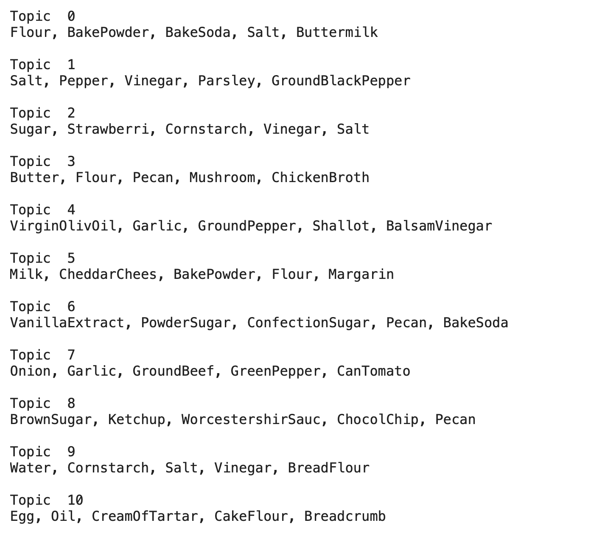

### MVP:

The focus of the project was to explore whether recipes could be recommended given a set of ingredients.

In order to produce a recommendation system, the following steps have been completed so far:

- Obtaining data on recipes 
- Formulating the preprocessing stage for recipe ingredients
- Transforming the recipe ingredients through the TFIDF Vectorizer
- Transforming the document-term matrix through the NMF Model

Here are the top 10 ingredients that have appeared in 1 million recipes (counts included): 

Here are the top 10 topics and their top 5 terms (NMF):

**Future Steps Include**:

- Making a recommendation system using the above topics
- Trying SVD
- Trying clustering methods
- Trying the inclusion of recipe instructions
